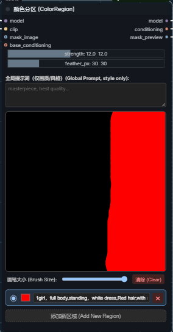
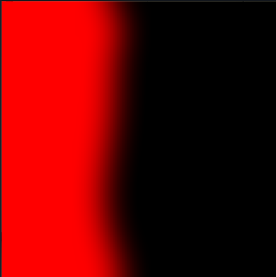
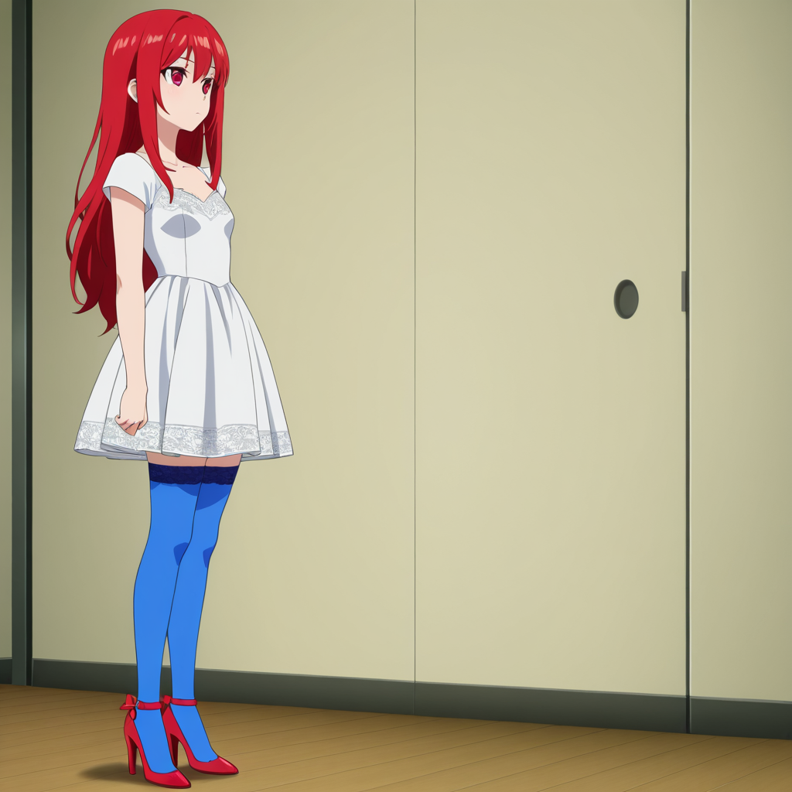
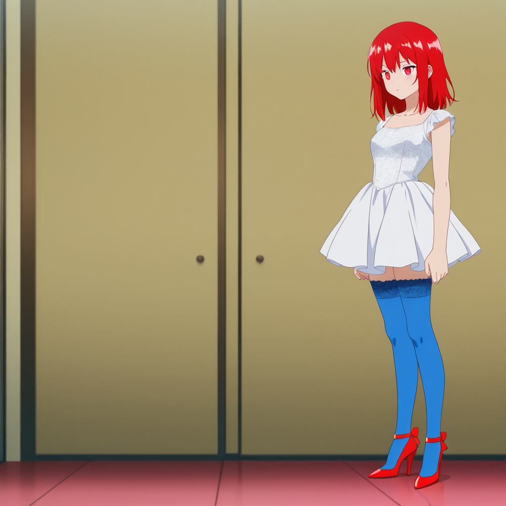

# ComfyUI-ColorRegion（颜色分区）

我之前使用过一些类似的提示词分区控制的插件，但是感觉效果不是很好，要不然就是节点太多了，所以我自己做了一个，效果如图：

| 蒙版 | 生成结果 |
|---|---|
|  |  |
|  |  |

## 参数

| 参数 | 作用 | 推荐值 |
|---|---|---|
| `strength` | 控制隔离力度，越大区域越独立 | 12~15 日常，18~25 极限 |
| `feather_px` | 羽化半径，控制区域边缘过渡柔和度 | 20~40（默认 30） |

串色 → 升 strength / 降 CFG；爆色块 → 降 strength / 降 CFG；接缝生硬 → 升 feather_px。

支持 `BREAK` 语法，其他语法（如 `ADDCOL`、`ADDROW` 等）不支持。

## 技术参考

- [DenseDiffusion](https://github.com/naver-ai/DenseDiffusion) (CVPR 2024) — Attention Modulation 机制
- [Attention Couple](https://github.com/laksjdjf/Attention-Couple) — Output Blending 算法框架
- [ComfyUI](https://github.com/comfyanonymous/ComfyUI) — 模块化 AI 图像生成框架

---

I've tried some similar prompt region control plugins before, but wasn't satisfied — either the results were poor or too many nodes were needed. So I built my own. Here's the result:

| Mask | Output |
|---|---|
|  |  |
|  |  |

## Parameters

| Parameter | Description | Recommended |
|---|---|---|
| `strength` | Isolation intensity — higher values keep regions more separate | 12–15 normal, 18–25 maximum |
| `feather_px` | Feather radius — controls edge softness between regions | 20–40 (default 30) |

Bleeding → raise strength / lower CFG. Artifacts → lower strength / lower CFG. Hard edges → raise feather_px.

Supports `BREAK` syntax. Other syntaxes (such as `ADDCOL`, `ADDROW`) are not supported.

## References

- [DenseDiffusion](https://github.com/naver-ai/DenseDiffusion) (CVPR 2024) — Attention Modulation
- [Attention Couple](https://github.com/laksjdjf/Attention-Couple) — Output Blending
- [ComfyUI](https://github.com/comfyanonymous/ComfyUI) — Modular AI image generation framework
